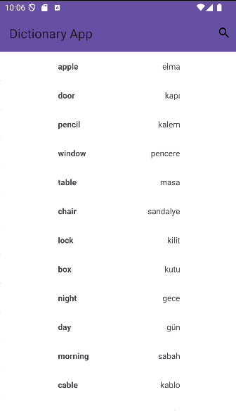
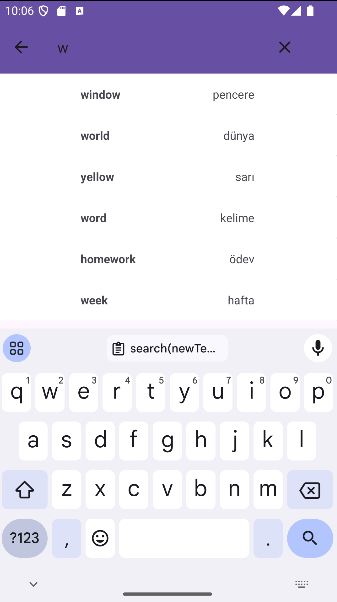

# Dictionary App

## Project Description
The **Dictionary App** is an Android application that allows users to browse and search for words along with their translations. The app retrieves English and Turkish word pairs from a database and displays them in a user-friendly interface using a **RecyclerView**. It demonstrates the use of a database adapter for seamless data retrieval and interaction.

## Features
- Stores and retrieves English-Turkish word pairs from an SQLite database.
- Displays words in a **RecyclerView** for easy navigation.
- Supports searching for specific words.
- Efficient data handling with a custom **Database Adapter**.
- User-friendly UI with smooth scrolling.

## Technologies Used
- **Kotlin** for Android development.
- **SQLite** for storing word pairs.
- **Android Studio** for development and debugging.

## How It Works
1. The application loads word pairs from the SQLite database.
2. The words are displayed in a **RecyclerView** using a custom adapter.
3. Users can scroll through the list or search for a specific word.
4. The app efficiently retrieves and displays matching results.
5. The interface updates dynamically based on user input.
 

## ScreenShots
<p align="center">
    
    
    
</p>


## Installation & Setup
1. Clone the repository:
   ```sh
   git clone https://github.com/AzizEkren/DictionaryApp
